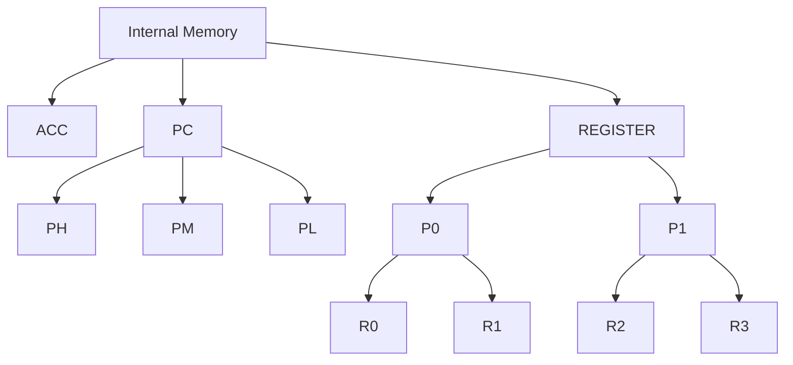

# cgen

cgen (CPU Generator) is a project designed to generate C++ Code which is
able to emulate a CPU if provided with a CPU Description. The goal is to
have an standardized way of emulating CPUs. There exist many different 
CPU Emulators of which some may be incomplete or written in a language 
unfit for peoples needs.
Generating code from one standardized therefore has multiple benefits:
    - easy implementation of CPU Emulators
    - interchangeability between different CPU Emulations
    - Code may be generated for multiple Programming Languages
    - With CHEAT (CPU Hardware Emulation) Hardware, which is no longer produced may be used to run legacy Code

# The Hardware Description File
cgen uses YAML files (Users may choose to write JSON Files and convert them to YAML if they prefer via f.E. [jsonformatter.org](https://jsonformatter.org/json-to-yaml) to describe Hardware.

The Description is split into 4 different sections:
    - General Information
    - Memory
    - Instruction Set
    - Display Information

## General Information
**name**: The name of CPU. This affects the Naming of Files and the CPU Class.
**description**: Information about the CPU, here one may specify the memory setup or design choices made in the description (f.E. if illegal opcodes are included)

## Memory
### internal
The internal memory is defined to be any CPU internal memory and organized in a tree structure. 

following definition would be interpreted as following diagram:
```yaml
    ACC: 4 # 4 bit
    PC: # implicit 12 bit
      PH: 4
      PM: 4
      PL: 4
    REGISTER: # implicit 16 bit
      P0: # implicit 8 bit
        R0: 4
        R1: 4
      P1: # implicit 8 bit
        R2: 4
        R3: 4
```

The internal memory is implemented as a continuos section of memory. Therefore addressing P0 is always synonymous as concatenating (R0,R1).
Therefore it is often wise to not only describe the physical properties of the CPU but also subsections of memory are addressed
by instructions.
Writing the memory in aforementioned way may be tiresome, therefore there is the possibility of using "loops".
the same Config can be written as:
```yaml
    ACC: 4 # 4 bit
    PC: # implicit 12 bit
      PH: 4
      PM: 4
      PL: 4
    REGISTER[2]: # implicit 16 bit
      P{$0}[2]: # implicit 8 bit
        R{2*$0+$1}: 4
```
Any text contained in curly brackets will be interpreted as formula and will be replaced with the integer result.
There may be loops inside of loops. The current index of each loop is stored in $0, $1, ... $n respectively. 
This syntax is very useful but may be hard to read, commenting is therefore strongly advised.

Memory must be defined as uppercase and must start with a Letter.

### external
The external memory is supposed to represent any external memory like RAM or FLASH memory.
Any external memory is implemented as an independent array with uniform word length.

```yaml
external:
  rom:
    words: 4096
    bits: 8
  ram:
    words: 2048
    bits: 4
```
This config tells cgen that the memory has 4096 characters of 8bit memory and 2048 words of 4bit memory.

## Instructions
Instructions are the main core of the CPU Description.

CPUs generally follow the Von Neumann Cycle: fetch - decode - execute.
Firstly one needs to specify how the CPU fetches an instruction.
An example is shown here:
```yaml
fetch:
  instructions:
    - "rom(PC)"
```
This config tells cgen to decode the value of the rom at the position pointed to by the PC (program counter).
In Certain CPUs the fetch cycle may change, therefore one may add
conditionals like so:

```yaml
fetch:
  conditions:
    - "use_ram = USE_RAM == 1"
  instructions:
    - "!use_ram? rom(PC)"
    - "use_ram? ram(PC)"
```

The decoding logic is generated automatically.
Now instructions have to be defined like this:

```yaml
instructions:
  nop:
    code: 0000 0000
    description: No Operation
    instructions:
      - PC + 1 --> PC
```

every child is interpreted of "instructions" is interpreted as
an instruction. Every instruction needs to have an instruction code which is compared to the value which is fetched. An optional
description may be supplied for documentation purposes.

Every instruction must contain at least one instruction string defined in the "instructions" array.
Instructions are always applied in order. If one wants to swap a 
value one has to do the following

```yaml
xch:
  description: |
    The 4 bit content of designated index register is loaded into the accumulator. 
    The prior content of the accumulator is loaded into the designed register. 
    The carry/link bit is unaffected.
  code: 1011 RRRR
  instructions:
    - (ACC, R{R}) --> R{R}, ACC
    - PC +1 --> PC
```

The comma operator first concatenates the two values and the
result is transferred into the specified Memory. The lowest bits are transferred to the leftmost Memory. This is done by writing the first bits of the same length as ACC into the accumulator and
afterwards shifting the result right for the same amount. Any excess bits are ignored, all missing bits are filled up with zeros. 

In the example above one may notice that the code of the "xch" instruction consists of a 4bit Parameter R. This parameter is then 
used to define the register which is to be swapped. This again, is done via string replacements for each possible value of R (0 - 15).

```yaml
jcn:
    description: |
      If the designated condition code is true, program control is transferred to the instruction 
      located at the 8 bit address A2A2A2A2, A1A1A1A1 on the same page (ROM) where JCN is located.
      If the condition is not true the next instruction in sequence after JCN is executed.
      The condition bits are assigned as follows:
      I = 0 Do not invert jump condition
      I = 1 Invert jump condition
      Z = 1 Jump if the accumulator content is zero
      O = 1 Jump if the carry/link content is 1
      T = 1 Jump if test signal (pin 10 on 4004) is zero.
    code: 0001 IZOT
    conditions:
      - zero = Z && (I ^ (ACC==0))
      - carry = O && ( I ^ (CY==1))
      - test = T && (I ^ (TEST==0))
      - jump = zero + carry + test
      - nextpage = (PM, PL) >= 254
    instructions:
      - "!jump? PC + 2 --> PC"
      - jump ? rom(PC+1) --> PM,PL
      - jump && nextpage ? PH +1 --> PH
```

For conditional branching one needs to use to use conditions. 
If one needs to do if/else branching or has complex conditions
it is not very convenient to define them inside the construction.
Because of this one may define boolean values inside the conditions
array. For boolean expressions C Syntax applies and any value greater 
than 0 will be interpreted as true.

```yaml
wr0:
    description: |
      The content of the accumulator is written into the RAM status character 
      0 of the previously selected RAM register. The accumulator and the carry/link 
      are unaffected.
    code: 1110 0100
    instructions:
      - ACC --> ram_status((X2, 0b00))
      - PC +1 --> PC
```
In this example one may see the use ob bitconstants.
A simple 0 is interpreted as an integer and therefore has
the length of 32 bits. If one wants define a value with a specific
amount of bits one can do so using the 0b Syntax, just like in C.
One also can see that concatenating two numbers should always be done
inside parenthesis.

## Display
At last one may define how the CPU should be displayed.
This is especially important while testing and is done via the
display parameter.

```yaml
display:  |
  "         STACK                REGISTERS
       PC 0x{PC}          R0 R1 0x{R0} 0x{R1}   R8 R9 0x{R8} 0x{R9}
  LEVEL 1 0x{STACK0}          R2 R3 0x{R2} 0x{R3}   RA RB 0x{R10} 0x{R11}
  LEVEL 2 0x{STACK1}          R4 R5 0x{R4} 0x{R5}   RA RB 0x{R12} 0x{R13}
  LEVEL 3 0x{STACK2}          R6 R7 0x{R6} 0x{R7}   RA RB 0x{R14} 0x{R15}

  ACCUMULATOR: {ACC} [0b{ACC}]  CARRY: 0b{CY}\n\n"
  ```

  Any Memory defined inside the curly braces is replaced by the value
  printed in dec, binary (0b{}) or hexadecimal (0x{})

# Installation
